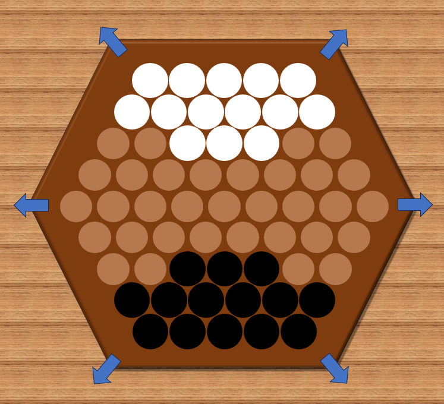
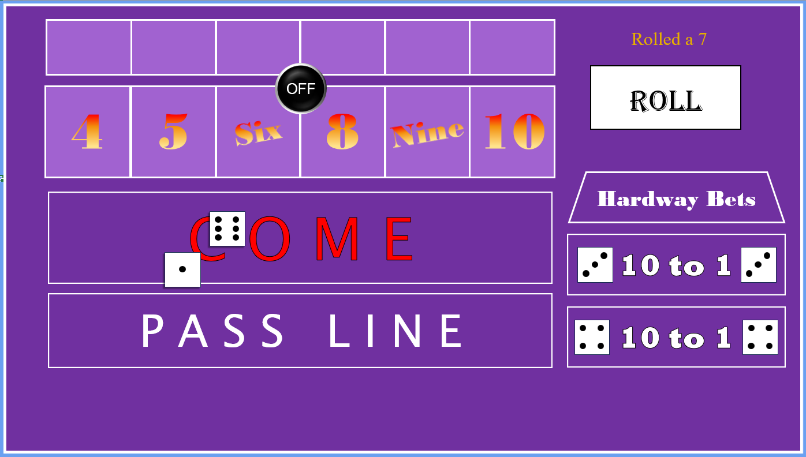
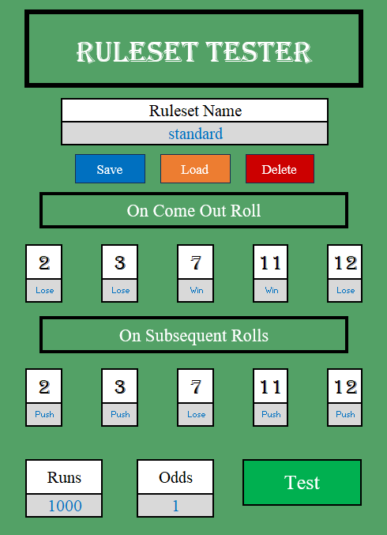

# Jonathon Leach
Software developer and creative

## About Me
I'm a Christian third culture kid who's travelled the world with my family as missionaries. I currently live in Romania. I have a passion for computer programming as well as music and writing.

## Projects
Here are some of the projects I've done so far. I hope to continue expanding this with more unique, interesting, and eye-catching projects!
### Abstract Strategy Game "Abalone" in Excel

[Project Link](https://github.com/SparklySpartan/AbaloneInExcel)

Abalone is an abstract strategy game that takes place on a hexagonal grid. The objective of the game is to push 6 of your opponents pieces off the board using your own. Players may move up to three marbles at a time, choosing to either move them in a straight line, in which case they can push a smaller group of enemy pieces in the same direction, or "flank" by moving them sideways, which can only be accomplished if there are no obstructions to where they want to go.

Excel is obviously not the best engine I could have chosen to remake this game in, but it was fun working around the challenges and stretching the power of VBA beyond what it was probably intended for. I learned a lot while making this project. Figuring out how to represent the game's information in the backend was a unique challenge, largely because the rules of this game don't operate on an orthagonal coordinate system. I learned about hexagonal coordinate systems and how I could reference each position on the board with a unique set of numbers assigned to it logically and consistently. I also learned concepts of implementing a turn based board game using code, and feel I could use them to make another game in the same genre of abstract strategy games if I wanted to. Writing the game logic for pushing pieces was an interesting and engaging task.

In the end I made a codebase I could be proud of. I almost couldn't take myself away from this project until it was finished!

## Craps in Excel

[Project Link](https://github.com/SparklySpartan/CrapsInExcel)

Craps is a popular dice game in casinos. The game revovles around the rolling of two dice. Various bets can be placed in the game of craps, and this version does not have all the bets implemented. 

Here are the bets you can make:

- Pass line bets
- Come line bets
- 6 and 8 Hardway bets

One of the things I like about this project is that it incorperates the user dragging around the shapes that represent the chips by hand, just like you would normally if you were editing an excel file. The game allows you to move your chips around but it will not allow you to do so in a way that breaks the rules. 

I also implemented a simple animation for the dice in excel. This is not what Excel was designed to do, and it has a tough time with complex animations, but it can be done.

You can try out the game yourself by downloading the file. Click the chips with dollar amounts displayed on the right to give yourself chips. Drag the chips to the places you want to bet. You may bet on the hard 6 or hard 8 at any time. You may only bet on the comeline while a passline bet is in progress

## Craps Montecarlo Simulator

[Project Link](https://github.com/SparklySpartan/ExcelMontecarloSimulator)

This is a program that could be used by a casino owner who wants to experiment and test out alternative rulesets for the game craps. Unlike the previous project which allows the user to play the game, this project simulates a large amount of games and extracts data from their results, it can then tell you whether or not the ruleset you made is profitable.
